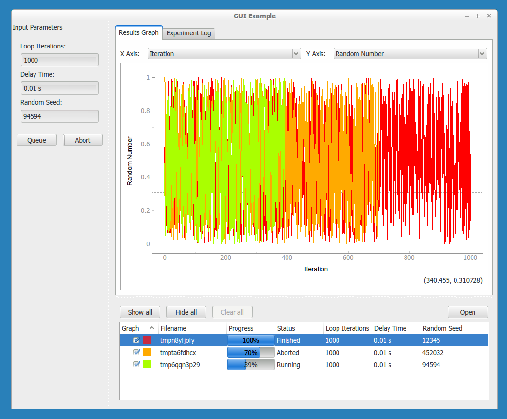

############
Introduction
############

PyMeasure uses an object-oriented approach for communicating with scientific instruments, which provides an intuitive interface where the low-level SCPI and GPIB commands are hidden from normal use. Users can focus on solving the measurement problems at hand, instead of re-inventing how to communicate with instruments. 

Instruments with VISA (GPIB, Serial, etc) are supported through the `PyVISA package`_ under the hood. `Prologix GPIB`_ adapters are also supported. Communication protocols can be swapped, so that instrument classes can be used with all supported protocols interchangeably.

.. _PyVISA package: https://pyvisa.readthedocs.io/en/latest/
.. _Prologix GPIB: http://prologix.biz/

Before using PyMeasure, you may find it helpful to be acquainted with `basic Python programming for the sciences`_ and understand the concept of objects.

.. _basic Python programming for the sciences: https://scipy-lectures.github.io/

Instrument ready
================

The package includes a number of :doc:`instruments already defined<api/instruments/index>`. Their definitions are organized based on the manufacturer name of the instrument. For example the class that defines the :doc:`Keithley 2400 SourceMeter<api/instruments/keithley/keithley2400>` can be imported by calling:

.. code-block:: python

  from pymeasure.instruments.keithley import Keithley2400

The :doc:`Tutorials <tutorial/index>` section will go into more detail on :doc:`connecting to an instrument <tutorial/connecting>`. If you don't find the instrument you are looking for, but are interested in contributing, see the documentation on :doc:`adding an instrument <dev/adding_instruments>`.

Graphical displays
==================

Graphical user interfaces (GUIs) can be easily generated to manage execution of measurement procedures with PyMeasure. This includes live plotting for data, and a queue system for managing large numbers of experiments.

These features are explored in the :doc:`Using a graphical interface <tutorial/graphical>` tutorial.

