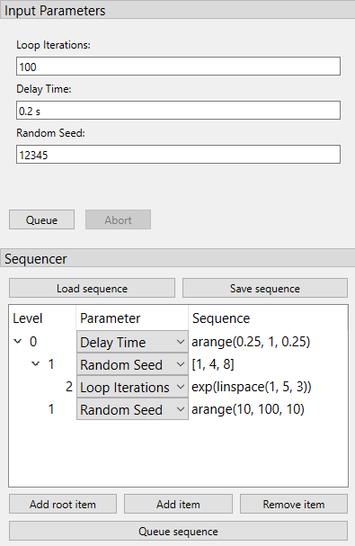

###########################
Using a graphical interface
###########################

In the previous tutorial we measured the IV characteristic of a sample to show how we can set up a simple experiment in PyMeasure. The real power of PyMeasure comes when we also use the graphical tools that are included to turn our simple example into a full-flegged user interface.

.. _tutorial-plotterwindow:

Using the Plotter
~~~~~~~~~~~~~~~~~

While it lacks the nice features of the ManagedWindow, the Plotter object is the simplest way of getting live-plotting. The Plotter takes a Results object and plots the data at a regular interval, grabbing the latest data each time from the file.

.. warning::
   The example in this section is known to raise issues when executed: a `QApplication was not created in the main thread` / `nextEventMatchingMask should only be called from the Main Thread` warning is raised.
   While the example works without issues on some operating systems and python configurations, users are advised not to rely on the plotter while this issue is unresolved.
   Users can hence skip this example and continue with the `Using the ManagedWindow`_ section.

Let's extend our SimpleProcedure with a RandomProcedure, which generates random numbers during our loop. This example does not include instruments to provide a simpler example. ::

    import logging
    log = logging.getLogger(__name__)
    log.addHandler(logging.NullHandler())

    import random
    from time import sleep
    from pymeasure.log import console_log
    from pymeasure.display import Plotter
    from pymeasure.experiment import Procedure, Results, Worker
    from pymeasure.experiment import IntegerParameter, FloatParameter, Parameter

    class RandomProcedure(Procedure):

        iterations = IntegerParameter('Loop Iterations')
        delay = FloatParameter('Delay Time', units='s', default=0.2)
        seed = Parameter('Random Seed', default='12345')

        DATA_COLUMNS = ['Iteration', 'Random Number']

        def startup(self):
            log.info("Setting the seed of the random number generator")
            random.seed(self.seed)

        def execute(self):
            log.info("Starting the loop of %d iterations" % self.iterations)
            for i in range(self.iterations):
                data = {
                    'Iteration': i,
                    'Random Number': random.random()
                }
                self.emit('results', data)
                log.debug("Emitting results: %s" % data)
                self.emit('progress', 100 * i / self.iterations)
                sleep(self.delay)
                if self.should_stop():
                    log.warning("Caught the stop flag in the procedure")
                    break

    if __name__ == "__main__":
        console_log(log)

        log.info("Constructing a RandomProcedure")
        procedure = RandomProcedure()
        procedure.iterations = 100

        data_filename = 'random.csv'
        log.info("Constructing the Results with a data file: %s" % data_filename)
        results = Results(procedure, data_filename)

        log.info("Constructing the Plotter")
        plotter = Plotter(results)
        plotter.start()
        log.info("Started the Plotter")

        log.info("Constructing the Worker")
        worker = Worker(results)
        worker.start()
        log.info("Started the Worker")

        log.info("Joining with the worker in at most 1 hr")
        worker.join(timeout=3600) # wait at most 1 hr (3600 sec)
        log.info("Finished the measurement")

The important addition is the construction of the Plotter from the Results object. ::

    plotter = Plotter(results)
    plotter.start()

The Plotter is started in a different process so that it can be run on a separate CPU for higher performance. The Plotter launches a Qt graphical interface using pyqtgraph which allows the Results data to be viewed based on the columns in the data.

.. image:: pymeasure-plotter.png
    :alt: Results Plotter Example

.. _tutorial-managedwindow:

Using the ManagedWindow
~~~~~~~~~~~~~~~~~~~~~~~

The ManagedWindow is the most convenient tool for running measurements with your Procedure. This has the major advantage of accepting the input parameters graphically. From the parameters, a graphical form is automatically generated that allows the inputs to be typed in. With this feature, measurements can be started dynamically, instead of defined in a script.

Another major feature of the ManagedWindow is its support for running measurements in a sequential queue. This allows you to set up a number of measurements with different input parameters, and watch them unfold on the live-plot. This is especially useful for long running measurements. The ManagedWindow achieves this through the Manager object, which coordinates which Procedure the Worker should run and keeps track of its status as the Worker progresses.

Below we adapt our previous example to use a ManagedWindow. ::

    import logging
    log = logging.getLogger(__name__)
    log.addHandler(logging.NullHandler())

    import sys
    import tempfile
    import random
    from time import sleep
    from pymeasure.log import console_log
    from pymeasure.display.Qt import QtGui
    from pymeasure.display.windows import ManagedWindow
    from pymeasure.experiment import Procedure, Results
    from pymeasure.experiment import IntegerParameter, FloatParameter, Parameter

    class RandomProcedure(Procedure):

        iterations = IntegerParameter('Loop Iterations')
        delay = FloatParameter('Delay Time', units='s', default=0.2)
        seed = Parameter('Random Seed', default='12345')

        DATA_COLUMNS = ['Iteration', 'Random Number']

        def startup(self):
            log.info("Setting the seed of the random number generator")
            random.seed(self.seed)

        def execute(self):
            log.info("Starting the loop of %d iterations" % self.iterations)
            for i in range(self.iterations):
                data = {
                    'Iteration': i,
                    'Random Number': random.random()
                }
                self.emit('results', data)
                log.debug("Emitting results: %s" % data)
                self.emit('progress', 100 * i / self.iterations)
                sleep(self.delay)
                if self.should_stop():
                    log.warning("Caught the stop flag in the procedure")
                    break

    class MainWindow(ManagedWindow):

        def __init__(self):
            super().__init__(
                procedure_class=RandomProcedure,
                inputs=['iterations', 'delay', 'seed'],
                displays=['iterations', 'delay', 'seed'],
                x_axis='Iteration',
                y_axis='Random Number'
            )
            self.setWindowTitle('GUI Example')

        def queue(self):
            filename = tempfile.mktemp()

            procedure = self.make_procedure()
            results = Results(procedure, filename)
            experiment = self.new_experiment(results)

            self.manager.queue(experiment)

    if __name__ == "__main__":
        app = QtGui.QApplication(sys.argv)
        window = MainWindow()
        window.show()
        sys.exit(app.exec_())

This results in the following graphical display.

.. image:: pymeasure-managedwindow.png
    :alt: ManagedWindow Example

In the code, the MainWindow class is a sub-class of the ManagedWindow class. We override the constructor to provide information about the procedure class and its options. The :code:`inputs` are a list of Parameters class-variable names, which the display will generate graphical fields for. When the list of inputs is long, a boolean key-word argument :code:`inputs_in_scrollarea` is provided that adds a scrollbar to the input area. The :code:`displays` is a list similar to the :code:`inputs` list, which instead defines the parameters to display in the browser window. This browser keeps track of the experiments being run in the sequential queue.

The :code:`queue` method establishes how the Procedure object is constructed. We use the :code:`self.make_procedure` method to create a Procedure based on the graphical input fields. Here we are free to modify the procedure before putting it on the queue. In this context, the Manager uses an Experiment object to keep track of the Procedure, Results, and its associated graphical representations in the browser and live-graph. This is then given to the Manager to queue the experiment.

.. image:: pymeasure-managedwindow-queued.png
    :alt: ManagedWindow Queue Example

By default the Manager starts a measurement when its procedure is queued. The abort button can be pressed to stop an experiment. In the Procedure, the :code:`self.should_stop` call will catch the abort event and halt the measurement. It is important to check this value, or the Procedure will not be responsive to the abort event.

.. image:: pymeasure-managedwindow-resume.png
    :alt: ManagedWindow Resume Example

If you abort a measurement, the resume button must be pressed to continue the next measurement. This allows you to adjust anything, which is presumably why the abort was needed.

.. image:: pymeasure-managedwindow-running.png
    :alt: ManagedWindow Running Example

Now that you have learned about the ManagedWindow, you have all of the basics to get up and running quickly with a measurement and produce an easy to use graphical interface with PyMeasure.

.. note::
   For performance reasons, the default linewidth of all the graphs has been set to 1.
   If performance is not an issue, the linewidth can be changed to 2 (or any other value) for better visibility by using the `linewidth` keyword-argument in the `Plotter` or the `ManagedWindow`.
   Whenever a linewidth of 2 is prefered and a better performance is required, it is possible to enable using OpenGL in the import section of the file: ::

      import pyqtgraph as pg
      pg.setConfigOption("useOpenGL", True)

Customising the plot options
~~~~~~~~~~~~~~~~~~~~~~~~~~~~

For both the PlotterWindow and ManagedWindow, plotting is provided by the pyqtgraph_ library. This library allows you to change various plot options, as you might expect: axis ranges (by default auto-ranging), logarithmic and semilogarithmic axes, downsampling, grid display, FFT display, etc. There are two main ways you can do this:

1. You can right click on the plot to manually change any available options. This is also a good way of getting an overview of what options are available in pyqtgraph. Option changes will, of course, not persist across a restart of your program.
2. You can programmatically set these options using pyqtgraph's PlotItem_ API, so that the window will open with these display options already set, as further explained below.

For :class:`~pymeasure.display.plotter.Plotter`, you can make a sub-class that overrides the :meth:`~pymeasure.display.plotter.Plotter.setup_plot` method. This method will be called when the Plotter constructs the window. As an example ::

    class LogPlotter(Plotter):
        def setup_plot(self, plot):
            # use logarithmic x-axis (e.g. for frequency sweeps)
            plot.setLogMode(x=True)

For :class:`~pymeasure.display.windows.ManagedWindow`, the mechanism to customize plots is much more flexible by using specialization via inheritance. Indeed :class:`~pymeasure.display.windows.ManagedWindowBase` is the base class for :class:`~pymeasure.display.windows.ManagedWindow` and :class:`~pymeasure.display.windows.ManagedImageWindow` which are subclasses ready to use for GUI.

Defining your own ManagedWindow's widgets
~~~~~~~~~~~~~~~~~~~~~~~~~~~~~~~~~~~~~~~~~

The parameter :code:`widget_list` in :class:`~pymeasure.display.windows.ManagedWindowBase` constructor allow to introduce user's defined widget in the GUI results display area.
The user's widget should inherit from :class:`~pymeasure.display.widgets.TabWidget` and could reimplement any of the methods that needs customization.
In order to get familiar with the mechanism, users can check the following widgets already provided:

- :class:`~pymeasure.display.widgets.LogWidget`
- :class:`~pymeasure.display.widgets.PlotWidget`
- :class:`~pymeasure.display.widgets.ImageWidget`

Using the sequencer
~~~~~~~~~~~~~~~~~~~

As an extension to the way of graphically inputting parameters and executing multiple measurements using the :class:`~pymeasure.display.windows.ManagedWindow`, :class:`~pymeasure.display.widgets.SequencerWidget` is provided which allows users to queue a series of measurements with varying one, or more, of the parameters. This sequencer thereby provides a convenient way to scan through the parameter space of the measurement procedure.

To activate the sequencer, two additional keyword arguments are added to :class:`~pymeasure.display.windows.ManagedWindow`, namely :code:`sequencer` and :code:`sequencer_inputs`. :code:`sequencer` accepts a boolean stating whether or not the sequencer has to be included into the window and :code:`sequencer_inputs` accepts either :code:`None` or a list of the parameter names are to be scanned over. If no list of parameters is given, the parameters displayed in the manager queue are used.

In order to be able to use the sequencer, the :class:`~pymeasure.display.windows.ManagedWindow` class is required to have a :code:`queue` method which takes a keyword (or better keyword-only for safety reasons) argument :code:`procedure`, where a procedure instance can be passed. The sequencer will use this method to queue the parameter scan. 

In order to implement the sequencer into the previous example, only the :class:`MainWindow` has to be modified slightly (where modified lines are marked):

.. code-block:: python
   :emphasize-lines: 10,11,12,16,19,20

    class MainWindow(ManagedWindow):

        def __init__(self):
            super().__init__(
                procedure_class=TestProcedure,
                inputs=['iterations', 'delay', 'seed'],
                displays=['iterations', 'delay', 'seed'],
                x_axis='Iteration',
                y_axis='Random Number',
                sequencer=True,                                      # Added line
                sequencer_inputs=['iterations', 'delay', 'seed'],    # Added line
                sequence_file="gui_sequencer_example_sequence.txt",  # Added line, optional
            )
            self.setWindowTitle('GUI Example')

        def queue(self, procedure=None):                             # Modified line
            filename = tempfile.mktemp()

            if procedure is None:                                    # Added line
                procedure = self.make_procedure()                    # Indented

            results = Results(procedure, filename)
            experiment = self.new_experiment(results)

            self.manager.queue(experiment)

This adds the sequencer underneath the the input panel.

The widget contains a tree-view where you can build the sequence.
It has three columns: :code:`level` (indicated how deep an item is nested), :code:`parameter` (a drop-down menu to select which parameter is being sequenced by that item), and :code:`sequence` (the text-box where you can define the sequence).
While the two former columns are rather straightforward, filling in the later requires some explanation.

In order to maintain flexibility, the sequence is defined in a text-box, allowing the user to enter any list-generating single-line piece of code.
To assist in this, a number of functions is supported, either from the main python library (namely :code:`range`, :code:`sorted`, and :code:`list`) or the numpy library.
The supported numpy functions (prepending :code:`numpy.` or any abbreviation is not required) are: :code:`arange`, :code:`linspace`, :code:`arccos`, :code:`arcsin`, :code:`arctan`, :code:`arctan2`, :code:`ceil`, :code:`cos`, :code:`cosh`, :code:`degrees`, :code:`e`, :code:`exp`, :code:`fabs`, :code:`floor`, :code:`fmod`, :code:`frexp`, :code:`hypot`, :code:`ldexp`, :code:`log`, :code:`log10`, :code:`modf`, :code:`pi`, :code:`power`, :code:`radians`, :code:`sin`, :code:`sinh`, :code:`sqrt`, :code:`tan`, and :code:`tanh`.

As an example, :code:`arange(0, 10, 1)` generates a list increasing with steps of 1, while using :code:`exp(arange(0, 10, 1))` generates an exponentially increasing list.
This way complex sequences can be entered easily.

The sequences can be extended and shortened using the buttons :code:`Add root item`, :code:`Add item`, and :code:`Remove item`.
The later two either add a item as a child of the currently selected item or remove the selected item, respectively.
To queue the entered sequence the button :code:`Queue` sequence can be used.
If an error occurs in evaluating the sequence text-boxes, this is mentioned in the logger, and nothing is queued.

Finally, it is possible to write a simple text file to quickly load a pre-defined sequence with the :code:`Load sequence` button, such that the user does not need to write the sequence again each time.
In the sequence file each line adds one item to the sequence tree, starting with a number of dashes (:code:`-`) to indicate the level of the item (starting with 1 dash for top level), followed by the name of the parameter and the sequence string, both as a python string between parentheses.
An example of such a sequence file is given below, resulting in the sequence shown in the figure above.

.. literalinclude:: gui_sequencer_example_sequence.txt

This file can also be automatically loaded at the start of the program by adding the key-word argument :code:`sequence_file="filename.txt"` to the :code:`super().__init__` call, as was done in the example.

Using the directory input
~~~~~~~~~~~~~~~~~~~~~~~~~

It is possible to add a directory input in order to choose where the experiment's result will be saved. This option is activated by passing a boolean key-word argument :code:`directory_input` during the :class:`~pymeasure.display.windows.ManagedWindow` init. The value of the directory can be retrieved and set using the property :code:`directory`.
A default directory can be defined by setting the :code:`directory` property in the MainWindow init.

Only the MainWindow needs to be modified in order to use this option (modified lines are marked).

.. code-block:: python
   :emphasize-lines: 10,13,16,17

    class MainWindow(ManagedWindow):

        def __init__(self):
            super().__init__(
                procedure_class=TestProcedure,
                inputs=['iterations', 'delay', 'seed'],
                displays=['iterations', 'delay', 'seed'],
                x_axis='Iteration',
                y_axis='Random Number',
                directory_input=True,                                # Added line, enables directory widget
            )
            self.setWindowTitle('GUI Example')
            self.directory = r'C:/Path/to/default/directory'         # Added line, sets default directory for GUI load

        def queue(self):
            directory = self.directory                               # Added line
            filename = unique_filename(directory)                    # Modified line

            results = Results(procedure, filename)
            experiment = self.new_experiment(results)

            self.manager.queue(experiment)

This adds the input line above the Queue and Abort buttons.

.. image:: pymeasure-directoryinput.png
    :alt: Example of the directory input widget

A completer is implemented allowing to quickly select an existing folder, and a button on the right side of the input widget opens a browse dialog.

Using the estimator widget
~~~~~~~~~~~~~~~~~~~~~~~~~~

In order to provide estimates of the measurement procedure, an :class:`~pymeasure.display.widgets.EstimatorWidget` is provided that allows the user to define and calculate estimates.
The widget is automatically activated when the :code:`get_estimates` method is added in the :code:`Procedure`.

The quickest and most simple implementation of the :code:`get_estimates` function simply returns the estimated duration of the measurement in seconds (as an :code:`int` or a :code:`float`).
As an example, in the example provided in the `Using the ManagedWindow`_ section, the :code:`Procedure` is changed to:

.. code-block:: python

   class RandomProcedure(Procedure):

       # ...

       def get_estimates(self, sequence_length=None, sequence=None):

           return self.iterations * self.delay

This will add the estimator widget at the dock on the left.
The duration and finishing-time of a single measurement is always displayed in this case.
Depending on whether the SequencerWidget is also used, the length, duration and finishing-time of the full sequence is also shown.

For maximum flexibility (e.g. for showing multiple and other types of estimates, such as the duration, filesize, finishing-time, etc.) it is also possible that the :code:`get_estimates` returns a list of tuples.
Each of these tuple consists of two strings: the first is the name (label) of the estimate, the second is the estimate itself.

As an example, in the example provided in the `Using the ManagedWindow`_ section, the :code:`Procedure` is changed to:

.. code-block:: python

   class RandomProcedure(Procedure):

       # ...

       def get_estimates(self, sequence_length=None, sequence=None):

           duration = self.iterations * self.delay

           estimates = [
               ("Duration", "%d s" % int(duration)),
               ("Number of lines", "%d" % int(self.iterations)),
               ("Sequence length", str(sequence_length)),
               ('Measurement finished at', str(datetime.now() + timedelta(seconds=duration))),
           ]

           return estimates

This will add the estimator widget at the dock on the left.

Note that after the initialisation of the widget both the label of the estimate as of course the estimate itself can be modified, but the amount of estimates is fixed.

The keyword arguments are not required in the implementation of the function, but are passed if asked for (i.e. :code:`def get_estimates(self)` does also works).
Keyword arguments that are accepted are :code:`sequence`, which contains the full sequence of the sequencer (if present), and :code:`sequence_length`, which gives the length of the sequence as integer (if present).
If the sequencer is not present or the sequence cannot be parsed, both :code:`sequence` and :code:`sequence_length` will contain :code:`None`.

The estimates are automatically updated every 2 seconds.
Changing this update interval is possible using the "Update continuously"-checkbox, which can be toggled between three states: off (i.e. no updating), auto-update every two seconds (default) or auto-update every 100 milliseconds.
Manually updating the estimates (useful whenever continuous updating is turned off) is also possible using the "update"-button.

Flexible hiding of inputs
~~~~~~~~~~~~~~~~~~~~~~~~~

There can be situations when it may be relevant to turn on or off a number of inputs (e.g. when a part of the measurement script is skipped upon turning of a single :code:`BooleanParameter`).
For these cases, it is possible to assign a :code:`Parameter` to a controlling :code:`Parameter`, which will hide or show the :code:`Input` of the :code:`Parameter` depending on the value of the :code:`Parameter`.
This is done with the :code:`group_by` key-word argument.

.. code-block:: python

    toggle = BooleanParameter("toggle", default=True)
    param = FloatParameter('some parameter', group_by='toggle')

When both the :code:`toggle` and :code:`param` are visible in the :code:`InputsWidget` (via :code:`inputs=['iterations', 'delay', 'seed']` as demonstrated above) one can control whether the input-field of :code:`param` is visible by checking and unchecking the checkbox of :code:`toggle`.
By default, the group will be visible if the value of the :code:`group_by` :code:`Parameter` is :code:`True` (which is only relevant for a :code:`BooleanParameter`), but it is possible to specify other value as conditions using the :code:`group_condition` keyword argument.

.. code-block:: python

    iterations = IntegerParameter('Loop Iterations', default=100)
    param = FloatParameter('some parameter', group_by='iterations', group_condition=99)

Here the input of :code:`param` is only visible if :code:`iterations` has a value of 99.
This works with any type of :code:`Parameter` as :code:`group_by` parameter.

To allow for even more flexibility, it is also possible to pass a (lambda)function as a condition:

.. code-block:: python

    iterations = IntegerParameter('Loop Iterations', default=100)
    param = FloatParameter('some parameter', group_by='iterations', group_condition=lambda v: 50 < v < 100)

Now the input of :code:`param` is only shown if the value of :code:`iterations` is between 51 and 99.

Using the :code:`hide_groups` keyword-argument of the :code:`ManagedWindow` you can choose between hiding the groups (:code:`hide_groups = True`) and disabling / graying-out the groups (:code:`hide_groups = False`).

Finally, it is also possible to provide multiple parameters to the :code:`group_by` argument, in which case the input will only be visible if all of the conditions are true.
Multiple parameters for grouping can either be passed as a dict of string: condition pairs, or as a list of strings, in which case the :code:`group_condition` can be either a single condition or a list of conditions:

.. code-block:: python

    iterations = IntegerParameter('Loop Iterations', default=100)
    toggle = BooleanParameter('A checkbox')
    param_A = FloatParameter('some parameter', group_by=['iterations', 'toggle'], group_condition=[lambda v: 50 < v < 100, True])
    param_B = FloatParameter('some parameter', group_by={'iterations': lambda v: 50 < v < 100, 'toggle': True})

Note that in this example, :code:`param_A` and :code:`param_B` are identically grouped: they're only visible if :code:`iterations` is between 51 and 99 and if the `toggle` checkbox is checked (i.e. True).

.. _pyqtgraph: http://www.pyqtgraph.org/
.. _PlotItem: http://www.pyqtgraph.org/documentation/graphicsItems/plotitem.html
